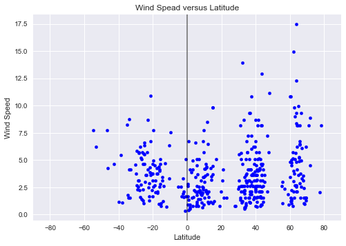

# What's the weather like as we approach the equator?

Create a Python script to visualize the weather of 500+ cities across the world of varying distance from the equator.

NOTE: This project takes into account the weather inforomation from one day. Each time the code is run it randomizes 500 cities and pulls the current weather data so the results of this code will vary each time it is run.


```python
# ependencies
import openweathermapy.core as owm
import json
import os
import csv
import matplotlib.pyplot as plt
import seaborn as sns
import pandas as pd
import numpy as np
import random
import requests
from citipy import citipy
from datetime import datetime as dt

# Get API key
from owm_config import api_key

# Set plot style
plt.style.use("seaborn")

# To hide warnings
import warnings
warnings.filterwarnings('ignore')
```

# Get 500 random cities and random distances from the equator


```python
# Getting lat/lng values for finding cities

# Set Lat & Lng Zones to randomly pick geo coordinates
lat_zone = np.arange(-90,90,15)
lng_zone = np.arange(-180,180,15)


# Creating df for geo coordinates
locations_df = pd.DataFrame()

locations_df["Lat"] = ""
locations_df["Lng"] = ""

# From each zone, randomly pick 50 unique coordinates and adding to the dataframe.
for x in lat_zone:
    for y in lng_zone:
        x_values = list(np.arange(x,x+15,0.01))
        y_values = list(np.arange(y,y+15,0.01))
        latitude = random.sample(x_values,50)
        longitude = random.sample(y_values,50)
        lat_samples = [(x+dec_lat) for dec_lat in latitude]
        lng_samples = [y+dec_lng for dec_lng in longitude]
        locations_df = locations_df.append(pd.DataFrame.from_dict({"Lat":lat_samples,
                                       "Lng":lng_samples}))
locations_df = locations_df.reset_index(drop=True)
locations_df.shape
```


    (14400, 2)


```python
# Using citipy to get nearest city to location coordinates

locations_df["Closest City"] = ""
locations_df["Country Code"] = ""
for index,row in locations_df.iterrows():
    city = citipy.nearest_city(row["Lat"],row["Lng"])
    locations_df.set_value(index,"Closest City",city.city_name)
    locations_df.set_value(index,"Country Code",city.country_code)
locations_df.head()

```


<div>
<style>
    .dataframe thead tr:only-child th {
        text-align: right;
    }

    .dataframe thead th {
        text-align: left;
    }

    .dataframe tbody tr th {
        vertical-align: top;
    }
</style>
<table border="1" class="dataframe">
  <thead>
    <tr style="text-align: right;">
      <th></th>
      <th>Lat</th>
      <th>Lng</th>
      <th>Closest City</th>
      <th>Country Code</th>
    </tr>
  </thead>
  <tbody>
    <tr>
      <th>0</th>
      <td>-179.21</td>
      <td>-357.73</td>
      <td>vaini</td>
      <td>to</td>
    </tr>
    <tr>
      <th>1</th>
      <td>-173.84</td>
      <td>-359.58</td>
      <td>vaini</td>
      <td>to</td>
    </tr>
    <tr>
      <th>2</th>
      <td>-178.75</td>
      <td>-346.87</td>
      <td>vaini</td>
      <td>to</td>
    </tr>
    <tr>
      <th>3</th>
      <td>-178.34</td>
      <td>-351.64</td>
      <td>vaini</td>
      <td>to</td>
    </tr>
    <tr>
      <th>4</th>
      <td>-165.04</td>
      <td>-357.85</td>
      <td>vaini</td>
      <td>to</td>
    </tr>
  </tbody>
</table>
</div>


```python
# Deleting random coordinates that do not match city coordinates

cities_df = locations_df.drop(['Lat', 'Lng'],axis=1)

# Dropping and duplicate cities
cities_df = cities_df.drop_duplicates()

cities_df.shape
```


    (878, 2)


```python
# Getting 500 random cities for the remaining list
random_cities = cities_df.sample(500)
random_cities = random_cities.reset_index(drop=True)
random_cities.head()
```


<div>
<style>
    .dataframe thead tr:only-child th {
        text-align: right;
    }

    .dataframe thead th {
        text-align: left;
    }

    .dataframe tbody tr th {
        vertical-align: top;
    }
</style>
<table border="1" class="dataframe">
  <thead>
    <tr style="text-align: right;">
      <th></th>
      <th>Closest City</th>
      <th>Country Code</th>
    </tr>
  </thead>
  <tbody>
    <tr>
      <th>0</th>
      <td>qibili</td>
      <td>tn</td>
    </tr>
    <tr>
      <th>1</th>
      <td>alakurtti</td>
      <td>ru</td>
    </tr>
    <tr>
      <th>2</th>
      <td>salym</td>
      <td>ru</td>
    </tr>
    <tr>
      <th>3</th>
      <td>sinjah</td>
      <td>sd</td>
    </tr>
    <tr>
      <th>4</th>
      <td>kagoro</td>
      <td>ng</td>
    </tr>
  </tbody>
</table>
</div>


# Get weather data for the 500 random cities selected above


```python
# Get current weather to see the JSON format
settings = {"units": "metric", "appid": api_key}
current_weather_clt = owm.get_current("Charlotte", **settings)
print(f"{json.dumps(current_weather_clt, indent=4)}")
```

    {
        "coord": {
            "lon": -80.84,
            "lat": 35.23
        },
        "weather": [
            {
                "id": 802,
                "main": "Clouds",
                "description": "scattered clouds",
                "icon": "03d"
            }
        ],
        "base": "stations",
        "main": {
            "temp": 3.33,
            "pressure": 1034,
            "humidity": 74,
            "temp_min": 2,
            "temp_max": 4
        },
        "visibility": 16093,
        "wind": {
            "speed": 2.1,
            "deg": 50
        },
        "clouds": {
            "all": 40
        },
        "dt": 1522067700,
        "sys": {
            "type": 1,
            "id": 1797,
            "message": 0.0039,
            "country": "US",
            "sunrise": 1522063063,
            "sunset": 1522107625
        },
        "id": 4460243,
        "name": "Charlotte",
        "cod": 200
    }
    


```python
# Setting up values for OpenWeatherMap API calls
base_url = "http://api.openweathermap.org/data/2.5/weather"

params = { "appid" :api_key,"units":"metric" }
```


```python
# Loop through to get Lat, Lng, Temp, Wind Speed, Humidity, and Cloudienss for each random city
# and append to random_cities

# I figured out how to hide my key
def encrypt_key(input_url):
    return input_url[0:53]+"<NoSeeMyKey>"+input_url[85:]

for index,row in random_cities.iterrows():
    params["q"] =f'{row["Closest City"]},{row["Country Code"]}'
    print(f"Processing Record {index+1} for: {params['q']}")
    city_weather = requests.get(base_url,params)
    print(encrypt_key(city_weather.url))
    city_weather  = city_weather.json()
    random_cities.set_value(index,"Latitude",city_weather.get("coord",{}).get("lat"))
    random_cities.set_value(index,"Longitude",city_weather.get("coord",{}).get("lon"))
    random_cities.set_value(index,"Temperature",city_weather.get("main",{}).get("temp_max"))
    random_cities.set_value(index,"Wind Speed",city_weather.get("wind",{}).get("speed"))
    random_cities.set_value(index,"Humidity",city_weather.get("main",{}).get("humidity"))
    random_cities.set_value(index,"Cloudiness",city_weather.get("clouds",{}).get("all"))
```

    Processing Record 1 for: qibili,tn
    http://api.openweathermap.org/data/2.5/weather?appid=<NoSeeMyKey>&units=metric&q=qibili%2Ctn
    Processing Record 2 for: alakurtti,ru
    http://api.openweathermap.org/data/2.5/weather?appid=<NoSeeMyKey>&units=metric&q=alakurtti%2Cru
    Processing Record 3 for: salym,ru
    http://api.openweathermap.org/data/2.5/weather?appid=<NoSeeMyKey>&units=metric&q=salym%2Cru
    Processing Record 4 for: sinjah,sd
    http://api.openweathermap.org/data/2.5/weather?appid=<NoSeeMyKey>&units=metric&q=sinjah%2Csd
    Processing Record 5 for: kagoro,ng
    http://api.openweathermap.org/data/2.5/weather?appid=<NoSeeMyKey>&units=metric&q=kagoro%2Cng
    Processing Record 6 for: onega,ru
    http://api.openweathermap.org/data/2.5/weather?appid=<NoSeeMyKey>&units=metric&q=onega%2Cru
    Processing Record 7 for: kumluca,tr
    http://api.openweathermap.org/data/2.5/weather?appid=<NoSeeMyKey>&units=metric&q=kumluca%2Ctr
    Processing Record 8 for: mersing,my
    http://api.openweathermap.org/data/2.5/weather?appid=<NoSeeMyKey>&units=metric&q=mersing%2Cmy
    Processing Record 9 for: hofn,is
    http://api.openweathermap.org/data/2.5/weather?appid=<NoSeeMyKey>&units=metric&q=hofn%2Cis
    Processing Record 10 for: benjamin hill,mx
    http://api.openweathermap.org/data/2.5/weather?appid=<NoSeeMyKey>&units=metric&q=benjamin+hill%2Cmx
    Processing Record 11 for: namatanai,pg
    http://api.openweathermap.org/data/2.5/weather?appid=<NoSeeMyKey>&units=metric&q=namatanai%2Cpg
    Processing Record 12 for: jilib,so
    http://api.openweathermap.org/data/2.5/weather?appid=<NoSeeMyKey>&units=metric&q=jilib%2Cso
    Processing Record 13 for: dokka,no
    http://api.openweathermap.org/data/2.5/weather?appid=<NoSeeMyKey>&units=metric&q=dokka%2Cno
    Processing Record 14 for: grand gaube,mu
    http://api.openweathermap.org/data/2.5/weather?appid=<NoSeeMyKey>&units=metric&q=grand+gaube%2Cmu
    Processing Record 15 for: attawapiskat,ca
    http://api.openweathermap.org/data/2.5/weather?appid=<NoSeeMyKey>&units=metric&q=attawapiskat%2Cca
    Processing Record 16 for: santa cruz das palmeiras,br
    http://api.openweathermap.org/data/2.5/weather?appid=<NoSeeMyKey>&units=metric&q=santa+cruz+das+palmeiras%2Cbr
    Processing Record 17 for: poya,nc
    http://api.openweathermap.org/data/2.5/weather?appid=<NoSeeMyKey>&units=metric&q=poya%2Cnc
    Processing Record 18 for: khandyga,ru
    http://api.openweathermap.org/data/2.5/weather?appid=<NoSeeMyKey>&units=metric&q=khandyga%2Cru
    Processing Record 19 for: fukue,jp
    http://api.openweathermap.org/data/2.5/weather?appid=<NoSeeMyKey>&units=metric&q=fukue%2Cjp
    Processing Record 20 for: ankpa,ng
    http://api.openweathermap.org/data/2.5/weather?appid=<NoSeeMyKey>&units=metric&q=ankpa%2Cng
    Processing Record 21 for: zabid,ye
    http://api.openweathermap.org/data/2.5/weather?appid=<NoSeeMyKey>&units=metric&q=zabid%2Cye
    Processing Record 22 for: west wendover,us
    http://api.openweathermap.org/data/2.5/weather?appid=<NoSeeMyKey>&units=metric&q=west+wendover%2Cus
    Processing Record 23 for: cedar city,us
    http://api.openweathermap.org/data/2.5/weather?appid=<NoSeeMyKey>&units=metric&q=cedar+city%2Cus
    Processing Record 24 for: atuona,pf
    http://api.openweathermap.org/data/2.5/weather?appid=<NoSeeMyKey>&units=metric&q=atuona%2Cpf
    Processing Record 25 for: maneadero,mx
    http://api.openweathermap.org/data/2.5/weather?appid=<NoSeeMyKey>&units=metric&q=maneadero%2Cmx
    Processing Record 26 for: save,bj
    http://api.openweathermap.org/data/2.5/weather?appid=<NoSeeMyKey>&units=metric&q=save%2Cbj
    Processing Record 27 for: yeppoon,au
    http://api.openweathermap.org/data/2.5/weather?appid=<NoSeeMyKey>&units=metric&q=yeppoon%2Cau
    Processing Record 28 for: gamboula,cf
    http://api.openweathermap.org/data/2.5/weather?appid=<NoSeeMyKey>&units=metric&q=gamboula%2Ccf
    Processing Record 29 for: rome,us
    http://api.openweathermap.org/data/2.5/weather?appid=<NoSeeMyKey>&units=metric&q=rome%2Cus
    Processing Record 30 for: rungata,ki
    http://api.openweathermap.org/data/2.5/weather?appid=<NoSeeMyKey>&units=metric&q=rungata%2Cki
    Processing Record 31 for: hilo,us
    http://api.openweathermap.org/data/2.5/weather?appid=<NoSeeMyKey>&units=metric&q=hilo%2Cus
    Processing Record 32 for: kankon,in
    http://api.openweathermap.org/data/2.5/weather?appid=<NoSeeMyKey>&units=metric&q=kankon%2Cin
    Processing Record 33 for: midland,us
    http://api.openweathermap.org/data/2.5/weather?appid=<NoSeeMyKey>&units=metric&q=midland%2Cus
    Processing Record 34 for: santiago,pe
    http://api.openweathermap.org/data/2.5/weather?appid=<NoSeeMyKey>&units=metric&q=santiago%2Cpe
    Processing Record 35 for: tuggurt,dz
    http://api.openweathermap.org/data/2.5/weather?appid=<NoSeeMyKey>&units=metric&q=tuggurt%2Cdz
    Processing Record 36 for: mount gambier,au
    http://api.openweathermap.org/data/2.5/weather?appid=<NoSeeMyKey>&units=metric&q=mount+gambier%2Cau
    Processing Record 37 for: hargeysa,so
    http://api.openweathermap.org/data/2.5/weather?appid=<NoSeeMyKey>&units=metric&q=hargeysa%2Cso
    Processing Record 38 for: stykkisholmur,is
    http://api.openweathermap.org/data/2.5/weather?appid=<NoSeeMyKey>&units=metric&q=stykkisholmur%2Cis
    Processing Record 39 for: kahului,us
    http://api.openweathermap.org/data/2.5/weather?appid=<NoSeeMyKey>&units=metric&q=kahului%2Cus
    Processing Record 40 for: xining,cn
    http://api.openweathermap.org/data/2.5/weather?appid=<NoSeeMyKey>&units=metric&q=xining%2Ccn
    Processing Record 41 for: kapoeta,sd
    http://api.openweathermap.org/data/2.5/weather?appid=<NoSeeMyKey>&units=metric&q=kapoeta%2Csd
    Processing Record 42 for: ye,mm
    http://api.openweathermap.org/data/2.5/weather?appid=<NoSeeMyKey>&units=metric&q=ye%2Cmm
    Processing Record 43 for: preobrazheniye,ru
    http://api.openweathermap.org/data/2.5/weather?appid=<NoSeeMyKey>&units=metric&q=preobrazheniye%2Cru
    Processing Record 44 for: pontal do parana,br
    http://api.openweathermap.org/data/2.5/weather?appid=<NoSeeMyKey>&units=metric&q=pontal+do+parana%2Cbr
    Processing Record 45 for: belmonte,br
    http://api.openweathermap.org/data/2.5/weather?appid=<NoSeeMyKey>&units=metric&q=belmonte%2Cbr
    Processing Record 46 for: liaoyang,cn
    http://api.openweathermap.org/data/2.5/weather?appid=<NoSeeMyKey>&units=metric&q=liaoyang%2Ccn
    Processing Record 47 for: sestri levante,it
    http://api.openweathermap.org/data/2.5/weather?appid=<NoSeeMyKey>&units=metric&q=sestri+levante%2Cit
    Processing Record 48 for: pandan,ph
    http://api.openweathermap.org/data/2.5/weather?appid=<NoSeeMyKey>&units=metric&q=pandan%2Cph
    Processing Record 49 for: seydi,tm
    http://api.openweathermap.org/data/2.5/weather?appid=<NoSeeMyKey>&units=metric&q=seydi%2Ctm
    Processing Record 50 for: makakilo city,us
    http://api.openweathermap.org/data/2.5/weather?appid=<NoSeeMyKey>&units=metric&q=makakilo+city%2Cus
    Processing Record 51 for: green river,us
    http://api.openweathermap.org/data/2.5/weather?appid=<NoSeeMyKey>&units=metric&q=green+river%2Cus
    Processing Record 52 for: mergui,mm
    http://api.openweathermap.org/data/2.5/weather?appid=<NoSeeMyKey>&units=metric&q=mergui%2Cmm
    Processing Record 53 for: orbetello,it
    http://api.openweathermap.org/data/2.5/weather?appid=<NoSeeMyKey>&units=metric&q=orbetello%2Cit
    Processing Record 54 for: illoqqortoormiut,gl
    http://api.openweathermap.org/data/2.5/weather?appid=<NoSeeMyKey>&units=metric&q=illoqqortoormiut%2Cgl
    Processing Record 55 for: igrim,ru
    http://api.openweathermap.org/data/2.5/weather?appid=<NoSeeMyKey>&units=metric&q=igrim%2Cru
    Processing Record 56 for: suntar,ru
    http://api.openweathermap.org/data/2.5/weather?appid=<NoSeeMyKey>&units=metric&q=suntar%2Cru
    Processing Record 57 for: bati,et
    http://api.openweathermap.org/data/2.5/weather?appid=<NoSeeMyKey>&units=metric&q=bati%2Cet
    Processing Record 58 for: saint george,bm
    http://api.openweathermap.org/data/2.5/weather?appid=<NoSeeMyKey>&units=metric&q=saint+george%2Cbm
    Processing Record 59 for: sabla,bg
    http://api.openweathermap.org/data/2.5/weather?appid=<NoSeeMyKey>&units=metric&q=sabla%2Cbg
    Processing Record 60 for: ionia,us
    http://api.openweathermap.org/data/2.5/weather?appid=<NoSeeMyKey>&units=metric&q=ionia%2Cus
    Processing Record 61 for: moree,au
    http://api.openweathermap.org/data/2.5/weather?appid=<NoSeeMyKey>&units=metric&q=moree%2Cau
    Processing Record 62 for: chiredzi,zw
    http://api.openweathermap.org/data/2.5/weather?appid=<NoSeeMyKey>&units=metric&q=chiredzi%2Czw
    Processing Record 63 for: mizdah,ly
    http://api.openweathermap.org/data/2.5/weather?appid=<NoSeeMyKey>&units=metric&q=mizdah%2Cly
    Processing Record 64 for: chagda,ru
    http://api.openweathermap.org/data/2.5/weather?appid=<NoSeeMyKey>&units=metric&q=chagda%2Cru
    Processing Record 65 for: kommunisticheskiy,ru
    http://api.openweathermap.org/data/2.5/weather?appid=<NoSeeMyKey>&units=metric&q=kommunisticheskiy%2Cru
    Processing Record 66 for: hirado,jp
    http://api.openweathermap.org/data/2.5/weather?appid=<NoSeeMyKey>&units=metric&q=hirado%2Cjp
    Processing Record 67 for: tokat,tr
    http://api.openweathermap.org/data/2.5/weather?appid=<NoSeeMyKey>&units=metric&q=tokat%2Ctr
    Processing Record 68 for: gazni,af
    http://api.openweathermap.org/data/2.5/weather?appid=<NoSeeMyKey>&units=metric&q=gazni%2Caf
    Processing Record 69 for: palmer,us
    http://api.openweathermap.org/data/2.5/weather?appid=<NoSeeMyKey>&units=metric&q=palmer%2Cus
    Processing Record 70 for: lipin bor,ru
    http://api.openweathermap.org/data/2.5/weather?appid=<NoSeeMyKey>&units=metric&q=lipin+bor%2Cru
    Processing Record 71 for: saskylakh,ru
    http://api.openweathermap.org/data/2.5/weather?appid=<NoSeeMyKey>&units=metric&q=saskylakh%2Cru
    Processing Record 72 for: imbituba,br
    http://api.openweathermap.org/data/2.5/weather?appid=<NoSeeMyKey>&units=metric&q=imbituba%2Cbr
    Processing Record 73 for: berlevag,no
    http://api.openweathermap.org/data/2.5/weather?appid=<NoSeeMyKey>&units=metric&q=berlevag%2Cno
    Processing Record 74 for: uglekamensk,ru
    http://api.openweathermap.org/data/2.5/weather?appid=<NoSeeMyKey>&units=metric&q=uglekamensk%2Cru
    Processing Record 75 for: bulancak,tr
    http://api.openweathermap.org/data/2.5/weather?appid=<NoSeeMyKey>&units=metric&q=bulancak%2Ctr
    Processing Record 76 for: khorixas,na
    http://api.openweathermap.org/data/2.5/weather?appid=<NoSeeMyKey>&units=metric&q=khorixas%2Cna
    Processing Record 77 for: amapa,br
    http://api.openweathermap.org/data/2.5/weather?appid=<NoSeeMyKey>&units=metric&q=amapa%2Cbr
    Processing Record 78 for: wadi maliz,tn
    http://api.openweathermap.org/data/2.5/weather?appid=<NoSeeMyKey>&units=metric&q=wadi+maliz%2Ctn
    Processing Record 79 for: numan,ng
    http://api.openweathermap.org/data/2.5/weather?appid=<NoSeeMyKey>&units=metric&q=numan%2Cng
    Processing Record 80 for: girua,br
    http://api.openweathermap.org/data/2.5/weather?appid=<NoSeeMyKey>&units=metric&q=girua%2Cbr
    Processing Record 81 for: ascension,mx
    http://api.openweathermap.org/data/2.5/weather?appid=<NoSeeMyKey>&units=metric&q=ascension%2Cmx
    Processing Record 82 for: yaan,cn
    http://api.openweathermap.org/data/2.5/weather?appid=<NoSeeMyKey>&units=metric&q=yaan%2Ccn
    Processing Record 83 for: zyryanka,ru
    http://api.openweathermap.org/data/2.5/weather?appid=<NoSeeMyKey>&units=metric&q=zyryanka%2Cru
    Processing Record 84 for: otukpo,ng
    http://api.openweathermap.org/data/2.5/weather?appid=<NoSeeMyKey>&units=metric&q=otukpo%2Cng
    Processing Record 85 for: artvin,tr
    http://api.openweathermap.org/data/2.5/weather?appid=<NoSeeMyKey>&units=metric&q=artvin%2Ctr
    Processing Record 86 for: susaki,jp
    http://api.openweathermap.org/data/2.5/weather?appid=<NoSeeMyKey>&units=metric&q=susaki%2Cjp
    Processing Record 87 for: cherskiy,ru
    http://api.openweathermap.org/data/2.5/weather?appid=<NoSeeMyKey>&units=metric&q=cherskiy%2Cru
    Processing Record 88 for: mahibadhoo,mv
    http://api.openweathermap.org/data/2.5/weather?appid=<NoSeeMyKey>&units=metric&q=mahibadhoo%2Cmv
    Processing Record 89 for: medvezhyegorsk,ru
    http://api.openweathermap.org/data/2.5/weather?appid=<NoSeeMyKey>&units=metric&q=medvezhyegorsk%2Cru
    Processing Record 90 for: san matias,bo
    http://api.openweathermap.org/data/2.5/weather?appid=<NoSeeMyKey>&units=metric&q=san+matias%2Cbo
    Processing Record 91 for: girne,cy
    http://api.openweathermap.org/data/2.5/weather?appid=<NoSeeMyKey>&units=metric&q=girne%2Ccy
    Processing Record 92 for: sao sebastiao,br
    http://api.openweathermap.org/data/2.5/weather?appid=<NoSeeMyKey>&units=metric&q=sao+sebastiao%2Cbr
    Processing Record 93 for: elizabeth city,us
    http://api.openweathermap.org/data/2.5/weather?appid=<NoSeeMyKey>&units=metric&q=elizabeth+city%2Cus
    Processing Record 94 for: nadvoitsy,ru
    http://api.openweathermap.org/data/2.5/weather?appid=<NoSeeMyKey>&units=metric&q=nadvoitsy%2Cru
    Processing Record 95 for: pangai,to
    http://api.openweathermap.org/data/2.5/weather?appid=<NoSeeMyKey>&units=metric&q=pangai%2Cto
    Processing Record 96 for: sorland,no
    http://api.openweathermap.org/data/2.5/weather?appid=<NoSeeMyKey>&units=metric&q=sorland%2Cno
    Processing Record 97 for: giyani,za
    http://api.openweathermap.org/data/2.5/weather?appid=<NoSeeMyKey>&units=metric&q=giyani%2Cza
    Processing Record 98 for: paamiut,gl
    http://api.openweathermap.org/data/2.5/weather?appid=<NoSeeMyKey>&units=metric&q=paamiut%2Cgl
    Processing Record 99 for: felidhoo,mv
    http://api.openweathermap.org/data/2.5/weather?appid=<NoSeeMyKey>&units=metric&q=felidhoo%2Cmv
    Processing Record 100 for: palamos,es
    http://api.openweathermap.org/data/2.5/weather?appid=<NoSeeMyKey>&units=metric&q=palamos%2Ces
    Processing Record 101 for: bolu,tr
    http://api.openweathermap.org/data/2.5/weather?appid=<NoSeeMyKey>&units=metric&q=bolu%2Ctr
    Processing Record 102 for: shu,kz
    http://api.openweathermap.org/data/2.5/weather?appid=<NoSeeMyKey>&units=metric&q=shu%2Ckz
    Processing Record 103 for: pompeia,br
    http://api.openweathermap.org/data/2.5/weather?appid=<NoSeeMyKey>&units=metric&q=pompeia%2Cbr
    Processing Record 104 for: kununurra,au
    http://api.openweathermap.org/data/2.5/weather?appid=<NoSeeMyKey>&units=metric&q=kununurra%2Cau
    Processing Record 105 for: umzimvubu,za
    http://api.openweathermap.org/data/2.5/weather?appid=<NoSeeMyKey>&units=metric&q=umzimvubu%2Cza
    Processing Record 106 for: ortakoy,tr
    http://api.openweathermap.org/data/2.5/weather?appid=<NoSeeMyKey>&units=metric&q=ortakoy%2Ctr
    Processing Record 107 for: luderitz,na
    http://api.openweathermap.org/data/2.5/weather?appid=<NoSeeMyKey>&units=metric&q=luderitz%2Cna
    Processing Record 108 for: mackay,au
    http://api.openweathermap.org/data/2.5/weather?appid=<NoSeeMyKey>&units=metric&q=mackay%2Cau
    Processing Record 109 for: las cruces,us
    http://api.openweathermap.org/data/2.5/weather?appid=<NoSeeMyKey>&units=metric&q=las+cruces%2Cus
    Processing Record 110 for: kloulklubed,pw
    http://api.openweathermap.org/data/2.5/weather?appid=<NoSeeMyKey>&units=metric&q=kloulklubed%2Cpw
    Processing Record 111 for: bambous virieux,mu
    http://api.openweathermap.org/data/2.5/weather?appid=<NoSeeMyKey>&units=metric&q=bambous+virieux%2Cmu
    Processing Record 112 for: hasaki,jp
    http://api.openweathermap.org/data/2.5/weather?appid=<NoSeeMyKey>&units=metric&q=hasaki%2Cjp
    Processing Record 113 for: gold coast,au
    http://api.openweathermap.org/data/2.5/weather?appid=<NoSeeMyKey>&units=metric&q=gold+coast%2Cau
    Processing Record 114 for: nong chik,th
    http://api.openweathermap.org/data/2.5/weather?appid=<NoSeeMyKey>&units=metric&q=nong+chik%2Cth
    Processing Record 115 for: alice springs,au
    http://api.openweathermap.org/data/2.5/weather?appid=<NoSeeMyKey>&units=metric&q=alice+springs%2Cau
    Processing Record 116 for: gardez,af
    http://api.openweathermap.org/data/2.5/weather?appid=<NoSeeMyKey>&units=metric&q=gardez%2Caf
    Processing Record 117 for: ixtapa,mx
    http://api.openweathermap.org/data/2.5/weather?appid=<NoSeeMyKey>&units=metric&q=ixtapa%2Cmx
    Processing Record 118 for: barentu,er
    http://api.openweathermap.org/data/2.5/weather?appid=<NoSeeMyKey>&units=metric&q=barentu%2Cer
    Processing Record 119 for: bagado,co
    http://api.openweathermap.org/data/2.5/weather?appid=<NoSeeMyKey>&units=metric&q=bagado%2Cco
    Processing Record 120 for: berbera,so
    http://api.openweathermap.org/data/2.5/weather?appid=<NoSeeMyKey>&units=metric&q=berbera%2Cso
    Processing Record 121 for: thompson,ca
    http://api.openweathermap.org/data/2.5/weather?appid=<NoSeeMyKey>&units=metric&q=thompson%2Cca
    Processing Record 122 for: hamada,jp
    http://api.openweathermap.org/data/2.5/weather?appid=<NoSeeMyKey>&units=metric&q=hamada%2Cjp
    Processing Record 123 for: zhuanghe,cn
    http://api.openweathermap.org/data/2.5/weather?appid=<NoSeeMyKey>&units=metric&q=zhuanghe%2Ccn
    Processing Record 124 for: dedza,mw
    http://api.openweathermap.org/data/2.5/weather?appid=<NoSeeMyKey>&units=metric&q=dedza%2Cmw
    Processing Record 125 for: vila do maio,cv
    http://api.openweathermap.org/data/2.5/weather?appid=<NoSeeMyKey>&units=metric&q=vila+do+maio%2Ccv
    Processing Record 126 for: warri,ng
    http://api.openweathermap.org/data/2.5/weather?appid=<NoSeeMyKey>&units=metric&q=warri%2Cng
    Processing Record 127 for: hovd,mn
    http://api.openweathermap.org/data/2.5/weather?appid=<NoSeeMyKey>&units=metric&q=hovd%2Cmn
    Processing Record 128 for: sistranda,no
    http://api.openweathermap.org/data/2.5/weather?appid=<NoSeeMyKey>&units=metric&q=sistranda%2Cno
    Processing Record 129 for: plymouth,us
    http://api.openweathermap.org/data/2.5/weather?appid=<NoSeeMyKey>&units=metric&q=plymouth%2Cus
    Processing Record 130 for: banda aceh,id
    http://api.openweathermap.org/data/2.5/weather?appid=<NoSeeMyKey>&units=metric&q=banda+aceh%2Cid
    Processing Record 131 for: ikornnes,no
    http://api.openweathermap.org/data/2.5/weather?appid=<NoSeeMyKey>&units=metric&q=ikornnes%2Cno
    Processing Record 132 for: lodeynoye pole,ru
    http://api.openweathermap.org/data/2.5/weather?appid=<NoSeeMyKey>&units=metric&q=lodeynoye+pole%2Cru
    Processing Record 133 for: worland,us
    http://api.openweathermap.org/data/2.5/weather?appid=<NoSeeMyKey>&units=metric&q=worland%2Cus
    Processing Record 134 for: litoral del san juan,co
    http://api.openweathermap.org/data/2.5/weather?appid=<NoSeeMyKey>&units=metric&q=litoral+del+san+juan%2Cco
    Processing Record 135 for: souillac,mu
    http://api.openweathermap.org/data/2.5/weather?appid=<NoSeeMyKey>&units=metric&q=souillac%2Cmu
    Processing Record 136 for: nogales,mx
    http://api.openweathermap.org/data/2.5/weather?appid=<NoSeeMyKey>&units=metric&q=nogales%2Cmx
    Processing Record 137 for: erdemli,tr
    http://api.openweathermap.org/data/2.5/weather?appid=<NoSeeMyKey>&units=metric&q=erdemli%2Ctr
    Processing Record 138 for: provideniya,ru
    http://api.openweathermap.org/data/2.5/weather?appid=<NoSeeMyKey>&units=metric&q=provideniya%2Cru
    Processing Record 139 for: sahrak,af
    http://api.openweathermap.org/data/2.5/weather?appid=<NoSeeMyKey>&units=metric&q=sahrak%2Caf
    Processing Record 140 for: bengkulu,id
    http://api.openweathermap.org/data/2.5/weather?appid=<NoSeeMyKey>&units=metric&q=bengkulu%2Cid
    Processing Record 141 for: byron bay,au
    http://api.openweathermap.org/data/2.5/weather?appid=<NoSeeMyKey>&units=metric&q=byron+bay%2Cau
    Processing Record 142 for: highland springs,us
    http://api.openweathermap.org/data/2.5/weather?appid=<NoSeeMyKey>&units=metric&q=highland+springs%2Cus
    Processing Record 143 for: port-de-bouc,fr
    http://api.openweathermap.org/data/2.5/weather?appid=<NoSeeMyKey>&units=metric&q=port-de-bouc%2Cfr
    Processing Record 144 for: kizema,ru
    http://api.openweathermap.org/data/2.5/weather?appid=<NoSeeMyKey>&units=metric&q=kizema%2Cru
    Processing Record 145 for: kazalinsk,kz
    http://api.openweathermap.org/data/2.5/weather?appid=<NoSeeMyKey>&units=metric&q=kazalinsk%2Ckz
    Processing Record 146 for: sakakah,sa
    http://api.openweathermap.org/data/2.5/weather?appid=<NoSeeMyKey>&units=metric&q=sakakah%2Csa
    Processing Record 147 for: carcassonne,fr
    http://api.openweathermap.org/data/2.5/weather?appid=<NoSeeMyKey>&units=metric&q=carcassonne%2Cfr
    Processing Record 148 for: yatou,cn
    http://api.openweathermap.org/data/2.5/weather?appid=<NoSeeMyKey>&units=metric&q=yatou%2Ccn
    Processing Record 149 for: necochea,ar
    http://api.openweathermap.org/data/2.5/weather?appid=<NoSeeMyKey>&units=metric&q=necochea%2Car
    Processing Record 150 for: gambela,et
    http://api.openweathermap.org/data/2.5/weather?appid=<NoSeeMyKey>&units=metric&q=gambela%2Cet
    Processing Record 151 for: huilong,cn
    http://api.openweathermap.org/data/2.5/weather?appid=<NoSeeMyKey>&units=metric&q=huilong%2Ccn
    Processing Record 152 for: kristiansund,no
    http://api.openweathermap.org/data/2.5/weather?appid=<NoSeeMyKey>&units=metric&q=kristiansund%2Cno
    Processing Record 153 for: longkou,cn
    http://api.openweathermap.org/data/2.5/weather?appid=<NoSeeMyKey>&units=metric&q=longkou%2Ccn
    Processing Record 154 for: mahaicony,gy
    http://api.openweathermap.org/data/2.5/weather?appid=<NoSeeMyKey>&units=metric&q=mahaicony%2Cgy
    Processing Record 155 for: nuuk,gl
    http://api.openweathermap.org/data/2.5/weather?appid=<NoSeeMyKey>&units=metric&q=nuuk%2Cgl
    Processing Record 156 for: malakal,sd
    http://api.openweathermap.org/data/2.5/weather?appid=<NoSeeMyKey>&units=metric&q=malakal%2Csd
    Processing Record 157 for: katherine,au
    http://api.openweathermap.org/data/2.5/weather?appid=<NoSeeMyKey>&units=metric&q=katherine%2Cau
    Processing Record 158 for: cacu,br
    http://api.openweathermap.org/data/2.5/weather?appid=<NoSeeMyKey>&units=metric&q=cacu%2Cbr
    Processing Record 159 for: viligili,mv
    http://api.openweathermap.org/data/2.5/weather?appid=<NoSeeMyKey>&units=metric&q=viligili%2Cmv
    Processing Record 160 for: luba,gq
    http://api.openweathermap.org/data/2.5/weather?appid=<NoSeeMyKey>&units=metric&q=luba%2Cgq
    Processing Record 161 for: yanji,cn
    http://api.openweathermap.org/data/2.5/weather?appid=<NoSeeMyKey>&units=metric&q=yanji%2Ccn
    Processing Record 162 for: ankazoabo,mg
    http://api.openweathermap.org/data/2.5/weather?appid=<NoSeeMyKey>&units=metric&q=ankazoabo%2Cmg
    Processing Record 163 for: churapcha,ru
    http://api.openweathermap.org/data/2.5/weather?appid=<NoSeeMyKey>&units=metric&q=churapcha%2Cru
    Processing Record 164 for: kaka,tm
    http://api.openweathermap.org/data/2.5/weather?appid=<NoSeeMyKey>&units=metric&q=kaka%2Ctm
    Processing Record 165 for: ossora,ru
    http://api.openweathermap.org/data/2.5/weather?appid=<NoSeeMyKey>&units=metric&q=ossora%2Cru
    Processing Record 166 for: ipora,br
    http://api.openweathermap.org/data/2.5/weather?appid=<NoSeeMyKey>&units=metric&q=ipora%2Cbr
    Processing Record 167 for: turukhansk,ru
    http://api.openweathermap.org/data/2.5/weather?appid=<NoSeeMyKey>&units=metric&q=turukhansk%2Cru
    Processing Record 168 for: akureyri,is
    http://api.openweathermap.org/data/2.5/weather?appid=<NoSeeMyKey>&units=metric&q=akureyri%2Cis
    Processing Record 169 for: kavieng,pg
    http://api.openweathermap.org/data/2.5/weather?appid=<NoSeeMyKey>&units=metric&q=kavieng%2Cpg
    Processing Record 170 for: ercis,tr
    http://api.openweathermap.org/data/2.5/weather?appid=<NoSeeMyKey>&units=metric&q=ercis%2Ctr
    Processing Record 171 for: redlands,us
    http://api.openweathermap.org/data/2.5/weather?appid=<NoSeeMyKey>&units=metric&q=redlands%2Cus
    Processing Record 172 for: constantine,dz
    http://api.openweathermap.org/data/2.5/weather?appid=<NoSeeMyKey>&units=metric&q=constantine%2Cdz
    Processing Record 173 for: novo horizonte,br
    http://api.openweathermap.org/data/2.5/weather?appid=<NoSeeMyKey>&units=metric&q=novo+horizonte%2Cbr
    Processing Record 174 for: birin,dz
    http://api.openweathermap.org/data/2.5/weather?appid=<NoSeeMyKey>&units=metric&q=birin%2Cdz
    Processing Record 175 for: mahajanga,mg
    http://api.openweathermap.org/data/2.5/weather?appid=<NoSeeMyKey>&units=metric&q=mahajanga%2Cmg
    Processing Record 176 for: aybak,af
    http://api.openweathermap.org/data/2.5/weather?appid=<NoSeeMyKey>&units=metric&q=aybak%2Caf
    Processing Record 177 for: barawe,so
    http://api.openweathermap.org/data/2.5/weather?appid=<NoSeeMyKey>&units=metric&q=barawe%2Cso
    Processing Record 178 for: san jose,ph
    http://api.openweathermap.org/data/2.5/weather?appid=<NoSeeMyKey>&units=metric&q=san+jose%2Cph
    Processing Record 179 for: bolungarvik,is
    http://api.openweathermap.org/data/2.5/weather?appid=<NoSeeMyKey>&units=metric&q=bolungarvik%2Cis
    Processing Record 180 for: kabanjahe,id
    http://api.openweathermap.org/data/2.5/weather?appid=<NoSeeMyKey>&units=metric&q=kabanjahe%2Cid
    Processing Record 181 for: charleston,us
    http://api.openweathermap.org/data/2.5/weather?appid=<NoSeeMyKey>&units=metric&q=charleston%2Cus
    Processing Record 182 for: busselton,au
    http://api.openweathermap.org/data/2.5/weather?appid=<NoSeeMyKey>&units=metric&q=busselton%2Cau
    Processing Record 183 for: east london,za
    http://api.openweathermap.org/data/2.5/weather?appid=<NoSeeMyKey>&units=metric&q=east+london%2Cza
    Processing Record 184 for: qinhuangdao,cn
    http://api.openweathermap.org/data/2.5/weather?appid=<NoSeeMyKey>&units=metric&q=qinhuangdao%2Ccn
    Processing Record 185 for: pahrump,us
    http://api.openweathermap.org/data/2.5/weather?appid=<NoSeeMyKey>&units=metric&q=pahrump%2Cus
    Processing Record 186 for: asaba,ng
    http://api.openweathermap.org/data/2.5/weather?appid=<NoSeeMyKey>&units=metric&q=asaba%2Cng
    Processing Record 187 for: kuandian,cn
    http://api.openweathermap.org/data/2.5/weather?appid=<NoSeeMyKey>&units=metric&q=kuandian%2Ccn
    Processing Record 188 for: yar-sale,ru
    http://api.openweathermap.org/data/2.5/weather?appid=<NoSeeMyKey>&units=metric&q=yar-sale%2Cru
    Processing Record 189 for: rosita,ni
    http://api.openweathermap.org/data/2.5/weather?appid=<NoSeeMyKey>&units=metric&q=rosita%2Cni
    Processing Record 190 for: honavar,in
    http://api.openweathermap.org/data/2.5/weather?appid=<NoSeeMyKey>&units=metric&q=honavar%2Cin
    Processing Record 191 for: cananeia,br
    http://api.openweathermap.org/data/2.5/weather?appid=<NoSeeMyKey>&units=metric&q=cananeia%2Cbr
    Processing Record 192 for: amga,ru
    http://api.openweathermap.org/data/2.5/weather?appid=<NoSeeMyKey>&units=metric&q=amga%2Cru
    Processing Record 193 for: keffi,ng
    http://api.openweathermap.org/data/2.5/weather?appid=<NoSeeMyKey>&units=metric&q=keffi%2Cng
    Processing Record 194 for: qasigiannguit,gl
    http://api.openweathermap.org/data/2.5/weather?appid=<NoSeeMyKey>&units=metric&q=qasigiannguit%2Cgl
    Processing Record 195 for: cabo san lucas,mx
    http://api.openweathermap.org/data/2.5/weather?appid=<NoSeeMyKey>&units=metric&q=cabo+san+lucas%2Cmx
    Processing Record 196 for: hay river,ca
    http://api.openweathermap.org/data/2.5/weather?appid=<NoSeeMyKey>&units=metric&q=hay+river%2Cca
    Processing Record 197 for: borama,so
    http://api.openweathermap.org/data/2.5/weather?appid=<NoSeeMyKey>&units=metric&q=borama%2Cso
    Processing Record 198 for: idaho falls,us
    http://api.openweathermap.org/data/2.5/weather?appid=<NoSeeMyKey>&units=metric&q=idaho+falls%2Cus
    Processing Record 199 for: mana,gf
    http://api.openweathermap.org/data/2.5/weather?appid=<NoSeeMyKey>&units=metric&q=mana%2Cgf
    Processing Record 200 for: hunza,pk
    http://api.openweathermap.org/data/2.5/weather?appid=<NoSeeMyKey>&units=metric&q=hunza%2Cpk
    Processing Record 201 for: wajir,ke
    http://api.openweathermap.org/data/2.5/weather?appid=<NoSeeMyKey>&units=metric&q=wajir%2Cke
    Processing Record 202 for: monchegorsk,ru
    http://api.openweathermap.org/data/2.5/weather?appid=<NoSeeMyKey>&units=metric&q=monchegorsk%2Cru
    Processing Record 203 for: san quintin,mx
    http://api.openweathermap.org/data/2.5/weather?appid=<NoSeeMyKey>&units=metric&q=san+quintin%2Cmx
    Processing Record 204 for: baghdad,iq
    http://api.openweathermap.org/data/2.5/weather?appid=<NoSeeMyKey>&units=metric&q=baghdad%2Ciq
    Processing Record 205 for: kirakira,sb
    http://api.openweathermap.org/data/2.5/weather?appid=<NoSeeMyKey>&units=metric&q=kirakira%2Csb
    Processing Record 206 for: sinop,tr
    http://api.openweathermap.org/data/2.5/weather?appid=<NoSeeMyKey>&units=metric&q=sinop%2Ctr
    Processing Record 207 for: hollins,us
    http://api.openweathermap.org/data/2.5/weather?appid=<NoSeeMyKey>&units=metric&q=hollins%2Cus
    Processing Record 208 for: lalibela,et
    http://api.openweathermap.org/data/2.5/weather?appid=<NoSeeMyKey>&units=metric&q=lalibela%2Cet
    Processing Record 209 for: hami,cn
    http://api.openweathermap.org/data/2.5/weather?appid=<NoSeeMyKey>&units=metric&q=hami%2Ccn
    Processing Record 210 for: laramie,us
    http://api.openweathermap.org/data/2.5/weather?appid=<NoSeeMyKey>&units=metric&q=laramie%2Cus
    Processing Record 211 for: bonthe,sl
    http://api.openweathermap.org/data/2.5/weather?appid=<NoSeeMyKey>&units=metric&q=bonthe%2Csl
    Processing Record 212 for: san vito,cr
    http://api.openweathermap.org/data/2.5/weather?appid=<NoSeeMyKey>&units=metric&q=san+vito%2Ccr
    Processing Record 213 for: muravlenko,ru
    http://api.openweathermap.org/data/2.5/weather?appid=<NoSeeMyKey>&units=metric&q=muravlenko%2Cru
    Processing Record 214 for: georgetown,gy
    http://api.openweathermap.org/data/2.5/weather?appid=<NoSeeMyKey>&units=metric&q=georgetown%2Cgy
    Processing Record 215 for: portoferraio,it
    http://api.openweathermap.org/data/2.5/weather?appid=<NoSeeMyKey>&units=metric&q=portoferraio%2Cit
    Processing Record 216 for: sedhiou,sn
    http://api.openweathermap.org/data/2.5/weather?appid=<NoSeeMyKey>&units=metric&q=sedhiou%2Csn
    Processing Record 217 for: touros,br
    http://api.openweathermap.org/data/2.5/weather?appid=<NoSeeMyKey>&units=metric&q=touros%2Cbr
    Processing Record 218 for: longyearbyen,sj
    http://api.openweathermap.org/data/2.5/weather?appid=<NoSeeMyKey>&units=metric&q=longyearbyen%2Csj
    Processing Record 219 for: nizhniy kuranakh,ru
    http://api.openweathermap.org/data/2.5/weather?appid=<NoSeeMyKey>&units=metric&q=nizhniy+kuranakh%2Cru
    Processing Record 220 for: ushuaia,ar
    http://api.openweathermap.org/data/2.5/weather?appid=<NoSeeMyKey>&units=metric&q=ushuaia%2Car
    Processing Record 221 for: lerwick,gb
    http://api.openweathermap.org/data/2.5/weather?appid=<NoSeeMyKey>&units=metric&q=lerwick%2Cgb
    Processing Record 222 for: eskisehir,tr
    http://api.openweathermap.org/data/2.5/weather?appid=<NoSeeMyKey>&units=metric&q=eskisehir%2Ctr
    Processing Record 223 for: kysyl-syr,ru
    http://api.openweathermap.org/data/2.5/weather?appid=<NoSeeMyKey>&units=metric&q=kysyl-syr%2Cru
    Processing Record 224 for: santa eulalia del rio,es
    http://api.openweathermap.org/data/2.5/weather?appid=<NoSeeMyKey>&units=metric&q=santa+eulalia+del+rio%2Ces
    Processing Record 225 for: quelimane,mz
    http://api.openweathermap.org/data/2.5/weather?appid=<NoSeeMyKey>&units=metric&q=quelimane%2Cmz
    Processing Record 226 for: kibre mengist,et
    http://api.openweathermap.org/data/2.5/weather?appid=<NoSeeMyKey>&units=metric&q=kibre+mengist%2Cet
    Processing Record 227 for: shenjiamen,cn
    http://api.openweathermap.org/data/2.5/weather?appid=<NoSeeMyKey>&units=metric&q=shenjiamen%2Ccn
    Processing Record 228 for: taquari,br
    http://api.openweathermap.org/data/2.5/weather?appid=<NoSeeMyKey>&units=metric&q=taquari%2Cbr
    Processing Record 229 for: silver city,us
    http://api.openweathermap.org/data/2.5/weather?appid=<NoSeeMyKey>&units=metric&q=silver+city%2Cus
    Processing Record 230 for: lovozero,ru
    http://api.openweathermap.org/data/2.5/weather?appid=<NoSeeMyKey>&units=metric&q=lovozero%2Cru
    Processing Record 231 for: grand river south east,mu
    http://api.openweathermap.org/data/2.5/weather?appid=<NoSeeMyKey>&units=metric&q=grand+river+south+east%2Cmu
    Processing Record 232 for: andenes,no
    http://api.openweathermap.org/data/2.5/weather?appid=<NoSeeMyKey>&units=metric&q=andenes%2Cno
    Processing Record 233 for: vaitupu,wf
    http://api.openweathermap.org/data/2.5/weather?appid=<NoSeeMyKey>&units=metric&q=vaitupu%2Cwf
    Processing Record 234 for: herat,af
    http://api.openweathermap.org/data/2.5/weather?appid=<NoSeeMyKey>&units=metric&q=herat%2Caf
    Processing Record 235 for: shaartuz,tj
    http://api.openweathermap.org/data/2.5/weather?appid=<NoSeeMyKey>&units=metric&q=shaartuz%2Ctj
    Processing Record 236 for: severnyy,ru
    http://api.openweathermap.org/data/2.5/weather?appid=<NoSeeMyKey>&units=metric&q=severnyy%2Cru
    Processing Record 237 for: maryborough,au
    http://api.openweathermap.org/data/2.5/weather?appid=<NoSeeMyKey>&units=metric&q=maryborough%2Cau
    Processing Record 238 for: kaduqli,sd
    http://api.openweathermap.org/data/2.5/weather?appid=<NoSeeMyKey>&units=metric&q=kaduqli%2Csd
    Processing Record 239 for: khasan,ru
    http://api.openweathermap.org/data/2.5/weather?appid=<NoSeeMyKey>&units=metric&q=khasan%2Cru
    Processing Record 240 for: picton,ca
    http://api.openweathermap.org/data/2.5/weather?appid=<NoSeeMyKey>&units=metric&q=picton%2Cca
    Processing Record 241 for: talnakh,ru
    http://api.openweathermap.org/data/2.5/weather?appid=<NoSeeMyKey>&units=metric&q=talnakh%2Cru
    Processing Record 242 for: turhal,tr
    http://api.openweathermap.org/data/2.5/weather?appid=<NoSeeMyKey>&units=metric&q=turhal%2Ctr
    Processing Record 243 for: rosetta,eg
    http://api.openweathermap.org/data/2.5/weather?appid=<NoSeeMyKey>&units=metric&q=rosetta%2Ceg
    Processing Record 244 for: oktyabrskoye,ru
    http://api.openweathermap.org/data/2.5/weather?appid=<NoSeeMyKey>&units=metric&q=oktyabrskoye%2Cru
    Processing Record 245 for: lodwar,ke
    http://api.openweathermap.org/data/2.5/weather?appid=<NoSeeMyKey>&units=metric&q=lodwar%2Cke
    Processing Record 246 for: fredericksburg,us
    http://api.openweathermap.org/data/2.5/weather?appid=<NoSeeMyKey>&units=metric&q=fredericksburg%2Cus
    Processing Record 247 for: chapada dos guimaraes,br
    http://api.openweathermap.org/data/2.5/weather?appid=<NoSeeMyKey>&units=metric&q=chapada+dos+guimaraes%2Cbr
    Processing Record 248 for: airai,pw
    http://api.openweathermap.org/data/2.5/weather?appid=<NoSeeMyKey>&units=metric&q=airai%2Cpw
    Processing Record 249 for: olbia,it
    http://api.openweathermap.org/data/2.5/weather?appid=<NoSeeMyKey>&units=metric&q=olbia%2Cit
    Processing Record 250 for: utica,us
    http://api.openweathermap.org/data/2.5/weather?appid=<NoSeeMyKey>&units=metric&q=utica%2Cus
    Processing Record 251 for: chieti,it
    http://api.openweathermap.org/data/2.5/weather?appid=<NoSeeMyKey>&units=metric&q=chieti%2Cit
    Processing Record 252 for: sarakhs,ir
    http://api.openweathermap.org/data/2.5/weather?appid=<NoSeeMyKey>&units=metric&q=sarakhs%2Cir
    Processing Record 253 for: louisbourg,ca
    http://api.openweathermap.org/data/2.5/weather?appid=<NoSeeMyKey>&units=metric&q=louisbourg%2Cca
    Processing Record 254 for: luganville,vu
    http://api.openweathermap.org/data/2.5/weather?appid=<NoSeeMyKey>&units=metric&q=luganville%2Cvu
    Processing Record 255 for: ballina,au
    http://api.openweathermap.org/data/2.5/weather?appid=<NoSeeMyKey>&units=metric&q=ballina%2Cau
    Processing Record 256 for: san policarpo,ph
    http://api.openweathermap.org/data/2.5/weather?appid=<NoSeeMyKey>&units=metric&q=san+policarpo%2Cph
    Processing Record 257 for: brae,gb
    http://api.openweathermap.org/data/2.5/weather?appid=<NoSeeMyKey>&units=metric&q=brae%2Cgb
    Processing Record 258 for: bairiki,ki
    http://api.openweathermap.org/data/2.5/weather?appid=<NoSeeMyKey>&units=metric&q=bairiki%2Cki
    Processing Record 259 for: abu jubayhah,sd
    http://api.openweathermap.org/data/2.5/weather?appid=<NoSeeMyKey>&units=metric&q=abu+jubayhah%2Csd
    Processing Record 260 for: otacilio costa,br
    http://api.openweathermap.org/data/2.5/weather?appid=<NoSeeMyKey>&units=metric&q=otacilio+costa%2Cbr
    Processing Record 261 for: qaqortoq,gl
    http://api.openweathermap.org/data/2.5/weather?appid=<NoSeeMyKey>&units=metric&q=qaqortoq%2Cgl
    Processing Record 262 for: los chiles,cr
    http://api.openweathermap.org/data/2.5/weather?appid=<NoSeeMyKey>&units=metric&q=los+chiles%2Ccr
    Processing Record 263 for: bluff,nz
    http://api.openweathermap.org/data/2.5/weather?appid=<NoSeeMyKey>&units=metric&q=bluff%2Cnz
    Processing Record 264 for: alamosa,us
    http://api.openweathermap.org/data/2.5/weather?appid=<NoSeeMyKey>&units=metric&q=alamosa%2Cus
    Processing Record 265 for: punta arenas,cl
    http://api.openweathermap.org/data/2.5/weather?appid=<NoSeeMyKey>&units=metric&q=punta+arenas%2Ccl
    Processing Record 266 for: andarab,af
    http://api.openweathermap.org/data/2.5/weather?appid=<NoSeeMyKey>&units=metric&q=andarab%2Caf
    Processing Record 267 for: iqaluit,ca
    http://api.openweathermap.org/data/2.5/weather?appid=<NoSeeMyKey>&units=metric&q=iqaluit%2Cca
    Processing Record 268 for: sindand,af
    http://api.openweathermap.org/data/2.5/weather?appid=<NoSeeMyKey>&units=metric&q=sindand%2Caf
    Processing Record 269 for: asayita,et
    http://api.openweathermap.org/data/2.5/weather?appid=<NoSeeMyKey>&units=metric&q=asayita%2Cet
    Processing Record 270 for: elko,us
    http://api.openweathermap.org/data/2.5/weather?appid=<NoSeeMyKey>&units=metric&q=elko%2Cus
    Processing Record 271 for: pafos,cy
    http://api.openweathermap.org/data/2.5/weather?appid=<NoSeeMyKey>&units=metric&q=pafos%2Ccy
    Processing Record 272 for: jibuti,dj
    http://api.openweathermap.org/data/2.5/weather?appid=<NoSeeMyKey>&units=metric&q=jibuti%2Cdj
    Processing Record 273 for: kaitangata,nz
    http://api.openweathermap.org/data/2.5/weather?appid=<NoSeeMyKey>&units=metric&q=kaitangata%2Cnz
    Processing Record 274 for: baglan,af
    http://api.openweathermap.org/data/2.5/weather?appid=<NoSeeMyKey>&units=metric&q=baglan%2Caf
    Processing Record 275 for: zonguldak,tr
    http://api.openweathermap.org/data/2.5/weather?appid=<NoSeeMyKey>&units=metric&q=zonguldak%2Ctr
    Processing Record 276 for: susanville,us
    http://api.openweathermap.org/data/2.5/weather?appid=<NoSeeMyKey>&units=metric&q=susanville%2Cus
    Processing Record 277 for: manado,id
    http://api.openweathermap.org/data/2.5/weather?appid=<NoSeeMyKey>&units=metric&q=manado%2Cid
    Processing Record 278 for: cermik,tr
    http://api.openweathermap.org/data/2.5/weather?appid=<NoSeeMyKey>&units=metric&q=cermik%2Ctr
    Processing Record 279 for: bay roberts,ca
    http://api.openweathermap.org/data/2.5/weather?appid=<NoSeeMyKey>&units=metric&q=bay+roberts%2Cca
    Processing Record 280 for: inta,ru
    http://api.openweathermap.org/data/2.5/weather?appid=<NoSeeMyKey>&units=metric&q=inta%2Cru
    Processing Record 281 for: betare oya,cm
    http://api.openweathermap.org/data/2.5/weather?appid=<NoSeeMyKey>&units=metric&q=betare+oya%2Ccm
    Processing Record 282 for: aksarka,ru
    http://api.openweathermap.org/data/2.5/weather?appid=<NoSeeMyKey>&units=metric&q=aksarka%2Cru
    Processing Record 283 for: mbini,gq
    http://api.openweathermap.org/data/2.5/weather?appid=<NoSeeMyKey>&units=metric&q=mbini%2Cgq
    Processing Record 284 for: quatre cocos,mu
    http://api.openweathermap.org/data/2.5/weather?appid=<NoSeeMyKey>&units=metric&q=quatre+cocos%2Cmu
    Processing Record 285 for: castres,fr
    http://api.openweathermap.org/data/2.5/weather?appid=<NoSeeMyKey>&units=metric&q=castres%2Cfr
    Processing Record 286 for: horasan,tr
    http://api.openweathermap.org/data/2.5/weather?appid=<NoSeeMyKey>&units=metric&q=horasan%2Ctr
    Processing Record 287 for: parrita,cr
    http://api.openweathermap.org/data/2.5/weather?appid=<NoSeeMyKey>&units=metric&q=parrita%2Ccr
    Processing Record 288 for: tigzirt,dz
    http://api.openweathermap.org/data/2.5/weather?appid=<NoSeeMyKey>&units=metric&q=tigzirt%2Cdz
    Processing Record 289 for: salalah,om
    http://api.openweathermap.org/data/2.5/weather?appid=<NoSeeMyKey>&units=metric&q=salalah%2Com
    Processing Record 290 for: turayf,sa
    http://api.openweathermap.org/data/2.5/weather?appid=<NoSeeMyKey>&units=metric&q=turayf%2Csa
    Processing Record 291 for: goderich,sl
    http://api.openweathermap.org/data/2.5/weather?appid=<NoSeeMyKey>&units=metric&q=goderich%2Csl
    Processing Record 292 for: lima,pe
    http://api.openweathermap.org/data/2.5/weather?appid=<NoSeeMyKey>&units=metric&q=lima%2Cpe
    Processing Record 293 for: farafenni,gm
    http://api.openweathermap.org/data/2.5/weather?appid=<NoSeeMyKey>&units=metric&q=farafenni%2Cgm
    Processing Record 294 for: somerset,us
    http://api.openweathermap.org/data/2.5/weather?appid=<NoSeeMyKey>&units=metric&q=somerset%2Cus
    Processing Record 295 for: ngukurr,au
    http://api.openweathermap.org/data/2.5/weather?appid=<NoSeeMyKey>&units=metric&q=ngukurr%2Cau
    Processing Record 296 for: ampanihy,mg
    http://api.openweathermap.org/data/2.5/weather?appid=<NoSeeMyKey>&units=metric&q=ampanihy%2Cmg
    Processing Record 297 for: along,in
    http://api.openweathermap.org/data/2.5/weather?appid=<NoSeeMyKey>&units=metric&q=along%2Cin
    Processing Record 298 for: port hueneme,us
    http://api.openweathermap.org/data/2.5/weather?appid=<NoSeeMyKey>&units=metric&q=port+hueneme%2Cus
    Processing Record 299 for: nadym,ru
    http://api.openweathermap.org/data/2.5/weather?appid=<NoSeeMyKey>&units=metric&q=nadym%2Cru
    Processing Record 300 for: zhigansk,ru
    http://api.openweathermap.org/data/2.5/weather?appid=<NoSeeMyKey>&units=metric&q=zhigansk%2Cru
    Processing Record 301 for: barentsburg,sj
    http://api.openweathermap.org/data/2.5/weather?appid=<NoSeeMyKey>&units=metric&q=barentsburg%2Csj
    Processing Record 302 for: mount pleasant,us
    http://api.openweathermap.org/data/2.5/weather?appid=<NoSeeMyKey>&units=metric&q=mount+pleasant%2Cus
    Processing Record 303 for: tura,ru
    http://api.openweathermap.org/data/2.5/weather?appid=<NoSeeMyKey>&units=metric&q=tura%2Cru
    Processing Record 304 for: lavrentiya,ru
    http://api.openweathermap.org/data/2.5/weather?appid=<NoSeeMyKey>&units=metric&q=lavrentiya%2Cru
    Processing Record 305 for: taybad,ir
    http://api.openweathermap.org/data/2.5/weather?appid=<NoSeeMyKey>&units=metric&q=taybad%2Cir
    Processing Record 306 for: sapao,ph
    http://api.openweathermap.org/data/2.5/weather?appid=<NoSeeMyKey>&units=metric&q=sapao%2Cph
    Processing Record 307 for: hermanus,za
    http://api.openweathermap.org/data/2.5/weather?appid=<NoSeeMyKey>&units=metric&q=hermanus%2Cza
    Processing Record 308 for: manokwari,id
    http://api.openweathermap.org/data/2.5/weather?appid=<NoSeeMyKey>&units=metric&q=manokwari%2Cid
    Processing Record 309 for: pilar,py
    http://api.openweathermap.org/data/2.5/weather?appid=<NoSeeMyKey>&units=metric&q=pilar%2Cpy
    Processing Record 310 for: port lincoln,au
    http://api.openweathermap.org/data/2.5/weather?appid=<NoSeeMyKey>&units=metric&q=port+lincoln%2Cau
    Processing Record 311 for: resistencia,ar
    http://api.openweathermap.org/data/2.5/weather?appid=<NoSeeMyKey>&units=metric&q=resistencia%2Car
    Processing Record 312 for: beira,mz
    http://api.openweathermap.org/data/2.5/weather?appid=<NoSeeMyKey>&units=metric&q=beira%2Cmz
    Processing Record 313 for: wendo,et
    http://api.openweathermap.org/data/2.5/weather?appid=<NoSeeMyKey>&units=metric&q=wendo%2Cet
    Processing Record 314 for: kingston,ca
    http://api.openweathermap.org/data/2.5/weather?appid=<NoSeeMyKey>&units=metric&q=kingston%2Cca
    Processing Record 315 for: khatanga,ru
    http://api.openweathermap.org/data/2.5/weather?appid=<NoSeeMyKey>&units=metric&q=khatanga%2Cru
    Processing Record 316 for: fairbanks,us
    http://api.openweathermap.org/data/2.5/weather?appid=<NoSeeMyKey>&units=metric&q=fairbanks%2Cus
    Processing Record 317 for: gazli,uz
    http://api.openweathermap.org/data/2.5/weather?appid=<NoSeeMyKey>&units=metric&q=gazli%2Cuz
    Processing Record 318 for: arraial do cabo,br
    http://api.openweathermap.org/data/2.5/weather?appid=<NoSeeMyKey>&units=metric&q=arraial+do+cabo%2Cbr
    Processing Record 319 for: fallon,us
    http://api.openweathermap.org/data/2.5/weather?appid=<NoSeeMyKey>&units=metric&q=fallon%2Cus
    Processing Record 320 for: qaanaaq,gl
    http://api.openweathermap.org/data/2.5/weather?appid=<NoSeeMyKey>&units=metric&q=qaanaaq%2Cgl
    Processing Record 321 for: muskegon,us
    http://api.openweathermap.org/data/2.5/weather?appid=<NoSeeMyKey>&units=metric&q=muskegon%2Cus
    Processing Record 322 for: acari,pe
    http://api.openweathermap.org/data/2.5/weather?appid=<NoSeeMyKey>&units=metric&q=acari%2Cpe
    Processing Record 323 for: pocone,br
    http://api.openweathermap.org/data/2.5/weather?appid=<NoSeeMyKey>&units=metric&q=pocone%2Cbr
    Processing Record 324 for: coxim,br
    http://api.openweathermap.org/data/2.5/weather?appid=<NoSeeMyKey>&units=metric&q=coxim%2Cbr
    Processing Record 325 for: burica,pa
    http://api.openweathermap.org/data/2.5/weather?appid=<NoSeeMyKey>&units=metric&q=burica%2Cpa
    Processing Record 326 for: tezu,in
    http://api.openweathermap.org/data/2.5/weather?appid=<NoSeeMyKey>&units=metric&q=tezu%2Cin
    Processing Record 327 for: kangaatsiaq,gl
    http://api.openweathermap.org/data/2.5/weather?appid=<NoSeeMyKey>&units=metric&q=kangaatsiaq%2Cgl
    Processing Record 328 for: yumen,cn
    http://api.openweathermap.org/data/2.5/weather?appid=<NoSeeMyKey>&units=metric&q=yumen%2Ccn
    Processing Record 329 for: new philadelphia,us
    http://api.openweathermap.org/data/2.5/weather?appid=<NoSeeMyKey>&units=metric&q=new+philadelphia%2Cus
    Processing Record 330 for: tasbuget,kz
    http://api.openweathermap.org/data/2.5/weather?appid=<NoSeeMyKey>&units=metric&q=tasbuget%2Ckz
    Processing Record 331 for: masvingo,zw
    http://api.openweathermap.org/data/2.5/weather?appid=<NoSeeMyKey>&units=metric&q=masvingo%2Czw
    Processing Record 332 for: nampa,us
    http://api.openweathermap.org/data/2.5/weather?appid=<NoSeeMyKey>&units=metric&q=nampa%2Cus
    Processing Record 333 for: arinos,br
    http://api.openweathermap.org/data/2.5/weather?appid=<NoSeeMyKey>&units=metric&q=arinos%2Cbr
    Processing Record 334 for: tosya,tr
    http://api.openweathermap.org/data/2.5/weather?appid=<NoSeeMyKey>&units=metric&q=tosya%2Ctr
    Processing Record 335 for: morristown,us
    http://api.openweathermap.org/data/2.5/weather?appid=<NoSeeMyKey>&units=metric&q=morristown%2Cus
    Processing Record 336 for: igboho,ng
    http://api.openweathermap.org/data/2.5/weather?appid=<NoSeeMyKey>&units=metric&q=igboho%2Cng
    Processing Record 337 for: pisco,pe
    http://api.openweathermap.org/data/2.5/weather?appid=<NoSeeMyKey>&units=metric&q=pisco%2Cpe
    Processing Record 338 for: ponnani,in
    http://api.openweathermap.org/data/2.5/weather?appid=<NoSeeMyKey>&units=metric&q=ponnani%2Cin
    Processing Record 339 for: bainbridge,us
    http://api.openweathermap.org/data/2.5/weather?appid=<NoSeeMyKey>&units=metric&q=bainbridge%2Cus
    Processing Record 340 for: anar darreh,af
    http://api.openweathermap.org/data/2.5/weather?appid=<NoSeeMyKey>&units=metric&q=anar+darreh%2Caf
    Processing Record 341 for: warqla,dz
    http://api.openweathermap.org/data/2.5/weather?appid=<NoSeeMyKey>&units=metric&q=warqla%2Cdz
    Processing Record 342 for: la palma,pa
    http://api.openweathermap.org/data/2.5/weather?appid=<NoSeeMyKey>&units=metric&q=la+palma%2Cpa
    Processing Record 343 for: dubti,et
    http://api.openweathermap.org/data/2.5/weather?appid=<NoSeeMyKey>&units=metric&q=dubti%2Cet
    Processing Record 344 for: port blair,in
    http://api.openweathermap.org/data/2.5/weather?appid=<NoSeeMyKey>&units=metric&q=port+blair%2Cin
    Processing Record 345 for: guaruja,br
    http://api.openweathermap.org/data/2.5/weather?appid=<NoSeeMyKey>&units=metric&q=guaruja%2Cbr
    Processing Record 346 for: catio,gw
    http://api.openweathermap.org/data/2.5/weather?appid=<NoSeeMyKey>&units=metric&q=catio%2Cgw
    Processing Record 347 for: xai-xai,mz
    http://api.openweathermap.org/data/2.5/weather?appid=<NoSeeMyKey>&units=metric&q=xai-xai%2Cmz
    Processing Record 348 for: harer,et
    http://api.openweathermap.org/data/2.5/weather?appid=<NoSeeMyKey>&units=metric&q=harer%2Cet
    Processing Record 349 for: peniche,pt
    http://api.openweathermap.org/data/2.5/weather?appid=<NoSeeMyKey>&units=metric&q=peniche%2Cpt
    Processing Record 350 for: cidreira,br
    http://api.openweathermap.org/data/2.5/weather?appid=<NoSeeMyKey>&units=metric&q=cidreira%2Cbr
    Processing Record 351 for: wana,pk
    http://api.openweathermap.org/data/2.5/weather?appid=<NoSeeMyKey>&units=metric&q=wana%2Cpk
    Processing Record 352 for: grindavik,is
    http://api.openweathermap.org/data/2.5/weather?appid=<NoSeeMyKey>&units=metric&q=grindavik%2Cis
    Processing Record 353 for: palimbang,ph
    http://api.openweathermap.org/data/2.5/weather?appid=<NoSeeMyKey>&units=metric&q=palimbang%2Cph
    Processing Record 354 for: samarai,pg
    http://api.openweathermap.org/data/2.5/weather?appid=<NoSeeMyKey>&units=metric&q=samarai%2Cpg
    Processing Record 355 for: martinsville,us
    http://api.openweathermap.org/data/2.5/weather?appid=<NoSeeMyKey>&units=metric&q=martinsville%2Cus
    Processing Record 356 for: kaseda,jp
    http://api.openweathermap.org/data/2.5/weather?appid=<NoSeeMyKey>&units=metric&q=kaseda%2Cjp
    Processing Record 357 for: san cristobal,ec
    http://api.openweathermap.org/data/2.5/weather?appid=<NoSeeMyKey>&units=metric&q=san+cristobal%2Cec
    Processing Record 358 for: colares,pt
    http://api.openweathermap.org/data/2.5/weather?appid=<NoSeeMyKey>&units=metric&q=colares%2Cpt
    Processing Record 359 for: ridgecrest,us
    http://api.openweathermap.org/data/2.5/weather?appid=<NoSeeMyKey>&units=metric&q=ridgecrest%2Cus
    Processing Record 360 for: ribeira grande,pt
    http://api.openweathermap.org/data/2.5/weather?appid=<NoSeeMyKey>&units=metric&q=ribeira+grande%2Cpt
    Processing Record 361 for: kontagora,ng
    http://api.openweathermap.org/data/2.5/weather?appid=<NoSeeMyKey>&units=metric&q=kontagora%2Cng
    Processing Record 362 for: terra rica,br
    http://api.openweathermap.org/data/2.5/weather?appid=<NoSeeMyKey>&units=metric&q=terra+rica%2Cbr
    Processing Record 363 for: gewane,et
    http://api.openweathermap.org/data/2.5/weather?appid=<NoSeeMyKey>&units=metric&q=gewane%2Cet
    Processing Record 364 for: phangnga,th
    http://api.openweathermap.org/data/2.5/weather?appid=<NoSeeMyKey>&units=metric&q=phangnga%2Cth
    Processing Record 365 for: pangody,ru
    http://api.openweathermap.org/data/2.5/weather?appid=<NoSeeMyKey>&units=metric&q=pangody%2Cru
    Processing Record 366 for: vaini,to
    http://api.openweathermap.org/data/2.5/weather?appid=<NoSeeMyKey>&units=metric&q=vaini%2Cto
    Processing Record 367 for: maloshuyka,ru
    http://api.openweathermap.org/data/2.5/weather?appid=<NoSeeMyKey>&units=metric&q=maloshuyka%2Cru
    Processing Record 368 for: caravelas,br
    http://api.openweathermap.org/data/2.5/weather?appid=<NoSeeMyKey>&units=metric&q=caravelas%2Cbr
    Processing Record 369 for: brignoles,fr
    http://api.openweathermap.org/data/2.5/weather?appid=<NoSeeMyKey>&units=metric&q=brignoles%2Cfr
    Processing Record 370 for: yellowknife,ca
    http://api.openweathermap.org/data/2.5/weather?appid=<NoSeeMyKey>&units=metric&q=yellowknife%2Cca
    Processing Record 371 for: danville,us
    http://api.openweathermap.org/data/2.5/weather?appid=<NoSeeMyKey>&units=metric&q=danville%2Cus
    Processing Record 372 for: cassilandia,br
    http://api.openweathermap.org/data/2.5/weather?appid=<NoSeeMyKey>&units=metric&q=cassilandia%2Cbr
    Processing Record 373 for: sibolga,id
    http://api.openweathermap.org/data/2.5/weather?appid=<NoSeeMyKey>&units=metric&q=sibolga%2Cid
    Processing Record 374 for: sheffield,us
    http://api.openweathermap.org/data/2.5/weather?appid=<NoSeeMyKey>&units=metric&q=sheffield%2Cus
    Processing Record 375 for: lagoa formosa,br
    http://api.openweathermap.org/data/2.5/weather?appid=<NoSeeMyKey>&units=metric&q=lagoa+formosa%2Cbr
    Processing Record 376 for: kamenskoye,ru
    http://api.openweathermap.org/data/2.5/weather?appid=<NoSeeMyKey>&units=metric&q=kamenskoye%2Cru
    Processing Record 377 for: kamaishi,jp
    http://api.openweathermap.org/data/2.5/weather?appid=<NoSeeMyKey>&units=metric&q=kamaishi%2Cjp
    Processing Record 378 for: oussouye,sn
    http://api.openweathermap.org/data/2.5/weather?appid=<NoSeeMyKey>&units=metric&q=oussouye%2Csn
    Processing Record 379 for: vyartsilya,ru
    http://api.openweathermap.org/data/2.5/weather?appid=<NoSeeMyKey>&units=metric&q=vyartsilya%2Cru
    Processing Record 380 for: dois vizinhos,br
    http://api.openweathermap.org/data/2.5/weather?appid=<NoSeeMyKey>&units=metric&q=dois+vizinhos%2Cbr
    Processing Record 381 for: denau,uz
    http://api.openweathermap.org/data/2.5/weather?appid=<NoSeeMyKey>&units=metric&q=denau%2Cuz
    Processing Record 382 for: tongliao,cn
    http://api.openweathermap.org/data/2.5/weather?appid=<NoSeeMyKey>&units=metric&q=tongliao%2Ccn
    Processing Record 383 for: kinanah,sd
    http://api.openweathermap.org/data/2.5/weather?appid=<NoSeeMyKey>&units=metric&q=kinanah%2Csd
    Processing Record 384 for: taywarah,af
    http://api.openweathermap.org/data/2.5/weather?appid=<NoSeeMyKey>&units=metric&q=taywarah%2Caf
    Processing Record 385 for: selfoss,is
    http://api.openweathermap.org/data/2.5/weather?appid=<NoSeeMyKey>&units=metric&q=selfoss%2Cis
    Processing Record 386 for: mutoko,zw
    http://api.openweathermap.org/data/2.5/weather?appid=<NoSeeMyKey>&units=metric&q=mutoko%2Czw
    Processing Record 387 for: jiayuguan,cn
    http://api.openweathermap.org/data/2.5/weather?appid=<NoSeeMyKey>&units=metric&q=jiayuguan%2Ccn
    Processing Record 388 for: dire dawa,et
    http://api.openweathermap.org/data/2.5/weather?appid=<NoSeeMyKey>&units=metric&q=dire+dawa%2Cet
    Processing Record 389 for: erdaojiang,cn
    http://api.openweathermap.org/data/2.5/weather?appid=<NoSeeMyKey>&units=metric&q=erdaojiang%2Ccn
    Processing Record 390 for: ranong,th
    http://api.openweathermap.org/data/2.5/weather?appid=<NoSeeMyKey>&units=metric&q=ranong%2Cth
    Processing Record 391 for: decatur,us
    http://api.openweathermap.org/data/2.5/weather?appid=<NoSeeMyKey>&units=metric&q=decatur%2Cus
    Processing Record 392 for: bundaberg,au
    http://api.openweathermap.org/data/2.5/weather?appid=<NoSeeMyKey>&units=metric&q=bundaberg%2Cau
    Processing Record 393 for: bastia,fr
    http://api.openweathermap.org/data/2.5/weather?appid=<NoSeeMyKey>&units=metric&q=bastia%2Cfr
    Processing Record 394 for: torres,br
    http://api.openweathermap.org/data/2.5/weather?appid=<NoSeeMyKey>&units=metric&q=torres%2Cbr
    Processing Record 395 for: barrow,us
    http://api.openweathermap.org/data/2.5/weather?appid=<NoSeeMyKey>&units=metric&q=barrow%2Cus
    Processing Record 396 for: evensk,ru
    http://api.openweathermap.org/data/2.5/weather?appid=<NoSeeMyKey>&units=metric&q=evensk%2Cru
    Processing Record 397 for: albany,au
    http://api.openweathermap.org/data/2.5/weather?appid=<NoSeeMyKey>&units=metric&q=albany%2Cau
    Processing Record 398 for: flagstaff,us
    http://api.openweathermap.org/data/2.5/weather?appid=<NoSeeMyKey>&units=metric&q=flagstaff%2Cus
    Processing Record 399 for: cody,us
    http://api.openweathermap.org/data/2.5/weather?appid=<NoSeeMyKey>&units=metric&q=cody%2Cus
    Processing Record 400 for: khoy,ir
    http://api.openweathermap.org/data/2.5/weather?appid=<NoSeeMyKey>&units=metric&q=khoy%2Cir
    Processing Record 401 for: ironton,us
    http://api.openweathermap.org/data/2.5/weather?appid=<NoSeeMyKey>&units=metric&q=ironton%2Cus
    Processing Record 402 for: waipawa,nz
    http://api.openweathermap.org/data/2.5/weather?appid=<NoSeeMyKey>&units=metric&q=waipawa%2Cnz
    Processing Record 403 for: tuktoyaktuk,ca
    http://api.openweathermap.org/data/2.5/weather?appid=<NoSeeMyKey>&units=metric&q=tuktoyaktuk%2Cca
    Processing Record 404 for: songjianghe,cn
    http://api.openweathermap.org/data/2.5/weather?appid=<NoSeeMyKey>&units=metric&q=songjianghe%2Ccn
    Processing Record 405 for: bure,et
    http://api.openweathermap.org/data/2.5/weather?appid=<NoSeeMyKey>&units=metric&q=bure%2Cet
    Processing Record 406 for: cumberland,us
    http://api.openweathermap.org/data/2.5/weather?appid=<NoSeeMyKey>&units=metric&q=cumberland%2Cus
    Processing Record 407 for: taman,ru
    http://api.openweathermap.org/data/2.5/weather?appid=<NoSeeMyKey>&units=metric&q=taman%2Cru
    Processing Record 408 for: sitka,us
    http://api.openweathermap.org/data/2.5/weather?appid=<NoSeeMyKey>&units=metric&q=sitka%2Cus
    Processing Record 409 for: pundaguitan,ph
    http://api.openweathermap.org/data/2.5/weather?appid=<NoSeeMyKey>&units=metric&q=pundaguitan%2Cph
    Processing Record 410 for: coolum beach,au
    http://api.openweathermap.org/data/2.5/weather?appid=<NoSeeMyKey>&units=metric&q=coolum+beach%2Cau
    Processing Record 411 for: alto araguaia,br
    http://api.openweathermap.org/data/2.5/weather?appid=<NoSeeMyKey>&units=metric&q=alto+araguaia%2Cbr
    Processing Record 412 for: lasa,cn
    http://api.openweathermap.org/data/2.5/weather?appid=<NoSeeMyKey>&units=metric&q=lasa%2Ccn
    Processing Record 413 for: port elizabeth,za
    http://api.openweathermap.org/data/2.5/weather?appid=<NoSeeMyKey>&units=metric&q=port+elizabeth%2Cza
    Processing Record 414 for: saint-pierre,pm
    http://api.openweathermap.org/data/2.5/weather?appid=<NoSeeMyKey>&units=metric&q=saint-pierre%2Cpm
    Processing Record 415 for: laguna,br
    http://api.openweathermap.org/data/2.5/weather?appid=<NoSeeMyKey>&units=metric&q=laguna%2Cbr
    Processing Record 416 for: curuca,br
    http://api.openweathermap.org/data/2.5/weather?appid=<NoSeeMyKey>&units=metric&q=curuca%2Cbr
    Processing Record 417 for: sevierville,us
    http://api.openweathermap.org/data/2.5/weather?appid=<NoSeeMyKey>&units=metric&q=sevierville%2Cus
    Processing Record 418 for: ous,ru
    http://api.openweathermap.org/data/2.5/weather?appid=<NoSeeMyKey>&units=metric&q=ous%2Cru
    Processing Record 419 for: snasa,no
    http://api.openweathermap.org/data/2.5/weather?appid=<NoSeeMyKey>&units=metric&q=snasa%2Cno
    Processing Record 420 for: asau,tv
    http://api.openweathermap.org/data/2.5/weather?appid=<NoSeeMyKey>&units=metric&q=asau%2Ctv
    Processing Record 421 for: severo-yeniseyskiy,ru
    http://api.openweathermap.org/data/2.5/weather?appid=<NoSeeMyKey>&units=metric&q=severo-yeniseyskiy%2Cru
    Processing Record 422 for: murgab,tm
    http://api.openweathermap.org/data/2.5/weather?appid=<NoSeeMyKey>&units=metric&q=murgab%2Ctm
    Processing Record 423 for: ternate,id
    http://api.openweathermap.org/data/2.5/weather?appid=<NoSeeMyKey>&units=metric&q=ternate%2Cid
    Processing Record 424 for: talaya,ru
    http://api.openweathermap.org/data/2.5/weather?appid=<NoSeeMyKey>&units=metric&q=talaya%2Cru
    Processing Record 425 for: sinnai,it
    http://api.openweathermap.org/data/2.5/weather?appid=<NoSeeMyKey>&units=metric&q=sinnai%2Cit
    Processing Record 426 for: manuk mangkaw,ph
    http://api.openweathermap.org/data/2.5/weather?appid=<NoSeeMyKey>&units=metric&q=manuk+mangkaw%2Cph
    Processing Record 427 for: guiratinga,br
    http://api.openweathermap.org/data/2.5/weather?appid=<NoSeeMyKey>&units=metric&q=guiratinga%2Cbr
    Processing Record 428 for: ugoofaaru,mv
    http://api.openweathermap.org/data/2.5/weather?appid=<NoSeeMyKey>&units=metric&q=ugoofaaru%2Cmv
    Processing Record 429 for: olga,ru
    http://api.openweathermap.org/data/2.5/weather?appid=<NoSeeMyKey>&units=metric&q=olga%2Cru
    Processing Record 430 for: torit,sd
    http://api.openweathermap.org/data/2.5/weather?appid=<NoSeeMyKey>&units=metric&q=torit%2Csd
    Processing Record 431 for: bandarbeyla,so
    http://api.openweathermap.org/data/2.5/weather?appid=<NoSeeMyKey>&units=metric&q=bandarbeyla%2Cso
    Processing Record 432 for: richards bay,za
    http://api.openweathermap.org/data/2.5/weather?appid=<NoSeeMyKey>&units=metric&q=richards+bay%2Cza
    Processing Record 433 for: salekhard,ru
    http://api.openweathermap.org/data/2.5/weather?appid=<NoSeeMyKey>&units=metric&q=salekhard%2Cru
    Processing Record 434 for: cartagena,co
    http://api.openweathermap.org/data/2.5/weather?appid=<NoSeeMyKey>&units=metric&q=cartagena%2Cco
    Processing Record 435 for: angoche,mz
    http://api.openweathermap.org/data/2.5/weather?appid=<NoSeeMyKey>&units=metric&q=angoche%2Cmz
    Processing Record 436 for: ilulissat,gl
    http://api.openweathermap.org/data/2.5/weather?appid=<NoSeeMyKey>&units=metric&q=ilulissat%2Cgl
    Processing Record 437 for: vryheid,za
    http://api.openweathermap.org/data/2.5/weather?appid=<NoSeeMyKey>&units=metric&q=vryheid%2Cza
    Processing Record 438 for: muzaffarabad,pk
    http://api.openweathermap.org/data/2.5/weather?appid=<NoSeeMyKey>&units=metric&q=muzaffarabad%2Cpk
    Processing Record 439 for: anloga,gh
    http://api.openweathermap.org/data/2.5/weather?appid=<NoSeeMyKey>&units=metric&q=anloga%2Cgh
    Processing Record 440 for: gap,fr
    http://api.openweathermap.org/data/2.5/weather?appid=<NoSeeMyKey>&units=metric&q=gap%2Cfr
    Processing Record 441 for: porto murtinho,br
    http://api.openweathermap.org/data/2.5/weather?appid=<NoSeeMyKey>&units=metric&q=porto+murtinho%2Cbr
    Processing Record 442 for: piney green,us
    http://api.openweathermap.org/data/2.5/weather?appid=<NoSeeMyKey>&units=metric&q=piney+green%2Cus
    Processing Record 443 for: libreville,ga
    http://api.openweathermap.org/data/2.5/weather?appid=<NoSeeMyKey>&units=metric&q=libreville%2Cga
    Processing Record 444 for: takoradi,gh
    http://api.openweathermap.org/data/2.5/weather?appid=<NoSeeMyKey>&units=metric&q=takoradi%2Cgh
    Processing Record 445 for: oswego,us
    http://api.openweathermap.org/data/2.5/weather?appid=<NoSeeMyKey>&units=metric&q=oswego%2Cus
    Processing Record 446 for: loyga,ru
    http://api.openweathermap.org/data/2.5/weather?appid=<NoSeeMyKey>&units=metric&q=loyga%2Cru
    Processing Record 447 for: ruatoria,nz
    http://api.openweathermap.org/data/2.5/weather?appid=<NoSeeMyKey>&units=metric&q=ruatoria%2Cnz
    Processing Record 448 for: deyang,cn
    http://api.openweathermap.org/data/2.5/weather?appid=<NoSeeMyKey>&units=metric&q=deyang%2Ccn
    Processing Record 449 for: ozu,jp
    http://api.openweathermap.org/data/2.5/weather?appid=<NoSeeMyKey>&units=metric&q=ozu%2Cjp
    Processing Record 450 for: san andres,co
    http://api.openweathermap.org/data/2.5/weather?appid=<NoSeeMyKey>&units=metric&q=san+andres%2Cco
    Processing Record 451 for: muroto,jp
    http://api.openweathermap.org/data/2.5/weather?appid=<NoSeeMyKey>&units=metric&q=muroto%2Cjp
    Processing Record 452 for: paranaiba,br
    http://api.openweathermap.org/data/2.5/weather?appid=<NoSeeMyKey>&units=metric&q=paranaiba%2Cbr
    Processing Record 453 for: bubaque,gw
    http://api.openweathermap.org/data/2.5/weather?appid=<NoSeeMyKey>&units=metric&q=bubaque%2Cgw
    Processing Record 454 for: tikrit,iq
    http://api.openweathermap.org/data/2.5/weather?appid=<NoSeeMyKey>&units=metric&q=tikrit%2Ciq
    Processing Record 455 for: gotsu,jp
    http://api.openweathermap.org/data/2.5/weather?appid=<NoSeeMyKey>&units=metric&q=gotsu%2Cjp
    Processing Record 456 for: komatipoort,za
    http://api.openweathermap.org/data/2.5/weather?appid=<NoSeeMyKey>&units=metric&q=komatipoort%2Cza
    Processing Record 457 for: funadhoo,mv
    http://api.openweathermap.org/data/2.5/weather?appid=<NoSeeMyKey>&units=metric&q=funadhoo%2Cmv
    Processing Record 458 for: la ronge,ca
    http://api.openweathermap.org/data/2.5/weather?appid=<NoSeeMyKey>&units=metric&q=la+ronge%2Cca
    Processing Record 459 for: port hedland,au
    http://api.openweathermap.org/data/2.5/weather?appid=<NoSeeMyKey>&units=metric&q=port+hedland%2Cau
    Processing Record 460 for: bedesa,et
    http://api.openweathermap.org/data/2.5/weather?appid=<NoSeeMyKey>&units=metric&q=bedesa%2Cet
    Processing Record 461 for: muisne,ec
    http://api.openweathermap.org/data/2.5/weather?appid=<NoSeeMyKey>&units=metric&q=muisne%2Cec
    Processing Record 462 for: bilibino,ru
    http://api.openweathermap.org/data/2.5/weather?appid=<NoSeeMyKey>&units=metric&q=bilibino%2Cru
    Processing Record 463 for: eureka,us
    http://api.openweathermap.org/data/2.5/weather?appid=<NoSeeMyKey>&units=metric&q=eureka%2Cus
    Processing Record 464 for: virginia beach,us
    http://api.openweathermap.org/data/2.5/weather?appid=<NoSeeMyKey>&units=metric&q=virginia+beach%2Cus
    Processing Record 465 for: mocambique,mz
    http://api.openweathermap.org/data/2.5/weather?appid=<NoSeeMyKey>&units=metric&q=mocambique%2Cmz
    Processing Record 466 for: tocopilla,cl
    http://api.openweathermap.org/data/2.5/weather?appid=<NoSeeMyKey>&units=metric&q=tocopilla%2Ccl
    Processing Record 467 for: teluk nibung,id
    http://api.openweathermap.org/data/2.5/weather?appid=<NoSeeMyKey>&units=metric&q=teluk+nibung%2Cid
    Processing Record 468 for: nicoya,cr
    http://api.openweathermap.org/data/2.5/weather?appid=<NoSeeMyKey>&units=metric&q=nicoya%2Ccr
    Processing Record 469 for: camana,pe
    http://api.openweathermap.org/data/2.5/weather?appid=<NoSeeMyKey>&units=metric&q=camana%2Cpe
    Processing Record 470 for: muzhi,ru
    http://api.openweathermap.org/data/2.5/weather?appid=<NoSeeMyKey>&units=metric&q=muzhi%2Cru
    Processing Record 471 for: edeia,br
    http://api.openweathermap.org/data/2.5/weather?appid=<NoSeeMyKey>&units=metric&q=edeia%2Cbr
    Processing Record 472 for: pinhao,br
    http://api.openweathermap.org/data/2.5/weather?appid=<NoSeeMyKey>&units=metric&q=pinhao%2Cbr
    Processing Record 473 for: muros,es
    http://api.openweathermap.org/data/2.5/weather?appid=<NoSeeMyKey>&units=metric&q=muros%2Ces
    Processing Record 474 for: ituni,gy
    http://api.openweathermap.org/data/2.5/weather?appid=<NoSeeMyKey>&units=metric&q=ituni%2Cgy
    Processing Record 475 for: solano,co
    http://api.openweathermap.org/data/2.5/weather?appid=<NoSeeMyKey>&units=metric&q=solano%2Cco
    Processing Record 476 for: maniitsoq,gl
    http://api.openweathermap.org/data/2.5/weather?appid=<NoSeeMyKey>&units=metric&q=maniitsoq%2Cgl
    Processing Record 477 for: duz,tn
    http://api.openweathermap.org/data/2.5/weather?appid=<NoSeeMyKey>&units=metric&q=duz%2Ctn
    Processing Record 478 for: hobart,au
    http://api.openweathermap.org/data/2.5/weather?appid=<NoSeeMyKey>&units=metric&q=hobart%2Cau
    Processing Record 479 for: rayong,th
    http://api.openweathermap.org/data/2.5/weather?appid=<NoSeeMyKey>&units=metric&q=rayong%2Cth
    Processing Record 480 for: esmeraldas,ec
    http://api.openweathermap.org/data/2.5/weather?appid=<NoSeeMyKey>&units=metric&q=esmeraldas%2Cec
    Processing Record 481 for: lancaster,us
    http://api.openweathermap.org/data/2.5/weather?appid=<NoSeeMyKey>&units=metric&q=lancaster%2Cus
    Processing Record 482 for: twentynine palms,us
    http://api.openweathermap.org/data/2.5/weather?appid=<NoSeeMyKey>&units=metric&q=twentynine+palms%2Cus
    Processing Record 483 for: beringovskiy,ru
    http://api.openweathermap.org/data/2.5/weather?appid=<NoSeeMyKey>&units=metric&q=beringovskiy%2Cru
    Processing Record 484 for: wukari,ng
    http://api.openweathermap.org/data/2.5/weather?appid=<NoSeeMyKey>&units=metric&q=wukari%2Cng
    Processing Record 485 for: wajima,jp
    http://api.openweathermap.org/data/2.5/weather?appid=<NoSeeMyKey>&units=metric&q=wajima%2Cjp
    Processing Record 486 for: mendahara,id
    http://api.openweathermap.org/data/2.5/weather?appid=<NoSeeMyKey>&units=metric&q=mendahara%2Cid
    Processing Record 487 for: mo i rana,no
    http://api.openweathermap.org/data/2.5/weather?appid=<NoSeeMyKey>&units=metric&q=mo+i+rana%2Cno
    Processing Record 488 for: villa hayes,py
    http://api.openweathermap.org/data/2.5/weather?appid=<NoSeeMyKey>&units=metric&q=villa+hayes%2Cpy
    Processing Record 489 for: nuevo casas grandes,mx
    http://api.openweathermap.org/data/2.5/weather?appid=<NoSeeMyKey>&units=metric&q=nuevo+casas+grandes%2Cmx
    Processing Record 490 for: gorontalo,id
    http://api.openweathermap.org/data/2.5/weather?appid=<NoSeeMyKey>&units=metric&q=gorontalo%2Cid
    Processing Record 491 for: villagarzon,co
    http://api.openweathermap.org/data/2.5/weather?appid=<NoSeeMyKey>&units=metric&q=villagarzon%2Cco
    Processing Record 492 for: beruni,uz
    http://api.openweathermap.org/data/2.5/weather?appid=<NoSeeMyKey>&units=metric&q=beruni%2Cuz
    Processing Record 493 for: timbiqui,co
    http://api.openweathermap.org/data/2.5/weather?appid=<NoSeeMyKey>&units=metric&q=timbiqui%2Cco
    Processing Record 494 for: kodiak,us
    http://api.openweathermap.org/data/2.5/weather?appid=<NoSeeMyKey>&units=metric&q=kodiak%2Cus
    Processing Record 495 for: naranjal,py
    http://api.openweathermap.org/data/2.5/weather?appid=<NoSeeMyKey>&units=metric&q=naranjal%2Cpy
    Processing Record 496 for: puerto ayora,ec
    http://api.openweathermap.org/data/2.5/weather?appid=<NoSeeMyKey>&units=metric&q=puerto+ayora%2Cec
    Processing Record 497 for: portland,au
    http://api.openweathermap.org/data/2.5/weather?appid=<NoSeeMyKey>&units=metric&q=portland%2Cau
    Processing Record 498 for: praia,cv
    http://api.openweathermap.org/data/2.5/weather?appid=<NoSeeMyKey>&units=metric&q=praia%2Ccv
    Processing Record 499 for: surat thani,th
    http://api.openweathermap.org/data/2.5/weather?appid=<NoSeeMyKey>&units=metric&q=surat+thani%2Cth
    Processing Record 500 for: hit,iq
    http://api.openweathermap.org/data/2.5/weather?appid=<NoSeeMyKey>&units=metric&q=hit%2Ciq
    


```python
# Drop cities with missing information and create csv file
random_cities = random_cities.dropna()
random_cities.to_csv("city_weather_data.csv")
print(random_cities.shape)
random_cities.head()
```

    (427, 8)
    


<div>
<style>
    .dataframe thead tr:only-child th {
        text-align: right;
    }

    .dataframe thead th {
        text-align: left;
    }

    .dataframe tbody tr th {
        vertical-align: top;
    }
</style>
<table border="1" class="dataframe">
  <thead>
    <tr style="text-align: right;">
      <th></th>
      <th>Closest City</th>
      <th>Country Code</th>
      <th>Latitude</th>
      <th>Longitude</th>
      <th>Temperature</th>
      <th>Wind Speed</th>
      <th>Humidity</th>
      <th>Cloudiness</th>
    </tr>
  </thead>
  <tbody>
    <tr>
      <th>1</th>
      <td>alakurtti</td>
      <td>ru</td>
      <td>66.96</td>
      <td>30.34</td>
      <td>-5.40</td>
      <td>3.32</td>
      <td>65.0</td>
      <td>56.0</td>
    </tr>
    <tr>
      <th>2</th>
      <td>salym</td>
      <td>ru</td>
      <td>60.06</td>
      <td>71.48</td>
      <td>-1.92</td>
      <td>4.82</td>
      <td>67.0</td>
      <td>80.0</td>
    </tr>
    <tr>
      <th>4</th>
      <td>kagoro</td>
      <td>ng</td>
      <td>9.60</td>
      <td>8.38</td>
      <td>34.03</td>
      <td>0.87</td>
      <td>27.0</td>
      <td>0.0</td>
    </tr>
    <tr>
      <th>5</th>
      <td>onega</td>
      <td>ru</td>
      <td>63.91</td>
      <td>38.09</td>
      <td>-6.40</td>
      <td>4.82</td>
      <td>85.0</td>
      <td>56.0</td>
    </tr>
    <tr>
      <th>6</th>
      <td>kumluca</td>
      <td>tr</td>
      <td>36.37</td>
      <td>30.29</td>
      <td>15.33</td>
      <td>1.12</td>
      <td>25.0</td>
      <td>0.0</td>
    </tr>
  </tbody>
</table>
</div>


# Scatterplots to visualize data for data analysis


# Maximum Temperature versus Latitude


```python
# Temperature vs Latitude 
random_cities.plot(kind="scatter",x="Latitude",y="Temperature",grid=True,color="blue")
plt.title(" Maximum Temperature (Celcius) versus Latitude")
plt.ylabel("Maximum Temperature (Celcius)")
plt.xlabel("Latitude")
plt.grid(True)
plt.xlim([-90,90])
plt.axvline(0, color='black',alpha=0.5)
plt.savefig("Maximum Temperature vs Latitude")
plt.show()
```


# Maximum Temperature versus Latitude - Observations
Temperatures do tend to be higher in cities that are closer to the equator.  You can see a downward trend in temperatures the farther away to go from the equator, especially in the northern hemisphere.  There are more cities in the sample population that are closer to the north pole compared to the south pole, which is likely because there are more cities in the northern hemisphere.


# Humidity versus Latitude


```python

# Humidity vs Latitude 

random_cities.plot(kind="scatter",x="Latitude",y="Humidity",grid=True,color="blue")
plt.title("Humidity versus Latitude")
plt.ylabel("Humidity")
plt.xlabel("Latitude")
plt.grid(True)
plt.xlim([-90,90])
plt.axvline(0, color='black',alpha=0.5)
plt.savefig("Humidity vs Latitude")
plt.show()
```


# Humidity versus Latitude - Observations
In this sample population there does appear to be a slight trend that the farther away from the equator, the lowest humidity levels tend to increase.  As this trend is very slight there could be some population bias.


# Wind Speed versus Latitude


```python
# Wind Speed vs Latitude
random_cities["Wind Speed"] = pd.to_numeric(random_cities["Wind Speed"])
random_cities.plot(kind="scatter",x="Latitude",y="Wind Speed",grid=True,color="blue")
plt.title("Wind Spead versus Latitude")
plt.ylabel("Wind Speed")
plt.xlabel("Latitude")
plt.grid(True)
plt.xlim([-90,90])
plt.axvline(0, color='black',alpha=0.5)
plt.savefig("Wind speed vs Latitude")
plt.show()
```





# Wind Speed versus Latitude - Observations
There does not appear to be a significant change in wind speed based on distace from the equator.  Generally, wind speeds are consistently below 10 KPH.  There are a few values over 10 KPH the farther away from the equator you go; however, there are very few and these could be outliers.


# Cloudiness versus Latitude


```python
# Cloudiness vs Latitude
random_cities["Cloudiness"] = pd.to_numeric(random_cities["Cloudiness"])
random_cities.plot(kind="scatter",x="Latitude",y="Cloudiness",grid=True,color="blue")
plt.title("Cloudiness versus Latitude")
plt.ylabel("Cloudiness")
plt.xlabel("Latitude")
plt.grid(True)
plt.xlim([-90,90])
plt.axvline(0, color='black',alpha=0.5)
plt.savefig("Cloudiness vs Latitude")
plt.show()
```


# Cloudiness versus Latitude - Observations
No significant trends can be seen in the data for this sample population.  Distance from the equator does not appear to be a factor in cloudiness.
